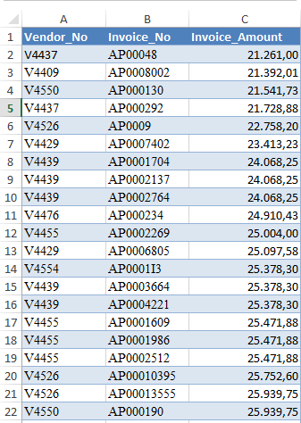

# Introdução

No Capítulo 11 do livro [Forensic Analytics](https://nigrini.com/forensicanalytics/)
(1^a^ Edição), Mark Nigrini descreve e implementa, usando Access e Excel, o
denominado **Relative Size Factor Test - RSF Test**, um teste para detecção de _outliers_ em
grupos de registros que compõem uma base de dados.

Essencialmente o teste busca identificar grupos de registros, usualmente
definidos por variáveis categóricas, para os quais o maior valor é significativamente
maior que os demais valores do grupo. 

Vamos ilustrar com um exemplo para tornar as coisas mais concretas. Suponha o 
seguinte conjunto de dados:

{width=50%}

A variável `Vendor_No` vai definir os grupos de registros, ou seja, cada código de vendedor
define um grupo enquanto a variável `Invoice_Amount` vai ser onde vamos buscar
os _outliers_, ou seja, onde vamos calcular o `RSF Factor`.

O `RSF Factor` é calculado tomando-se o quociente entre o maior valor no grupo e
o segundo maior valor, também no grupo. Simples assim. 

Em termos matemáticos:

$$
RSF\_factor = \frac{maximo\_valor\_grupo}{segundo\_maior\_valor\_grupo}
$$

Então para cada vendedor vamos identificar as faturas por ele emitidas, identificar
os dois valores de interesse (primeiro e segundo maiores valores) e calcular o
quociente.

O autor levanta algumas questões de ordem prática relacionadas à implementação 
deste teste. A primeira questão diz respeito ao fato de que, grupos contendo
apenas um valor não pode gerar um `RSF_Factor` pela simples razão de não existir
um segundo maior valor. Também comenta ser uma boa ideia excluir valores menores
que 1,00 ou 10,00 e não incluir valores negativos.

O autor aponta também o desafio de identificar o segundo maior valor no grupo,
o que requer estabelecer uma regra para definição do segundo maior valor nos
casos em que se tem mais de um valor máximo no grupo.

O autor propõe um passo a passo para a implementação do teste e
mostra como implementá-lo usando o Microsoft Access e o Maicrosoft Excel.


# Implementação do Teste em R

Nosso objetivo neste documento é mostrar como o teste pode ser implementado
usando o R e para isso vamos inicialmente escrever um _script_ para a execução
do teste que posteriormente será convertido em uma função.

Vamos utilizar um conjunto de dados simples (`RSF.xlsx`) para esse propósito.

Esse conjunto de dados pode ser baixado na seguinte página: http://www.ashishmathur.com/compute-relative-size-factor-per-vendor/ 

Vamos à importação dos dados:

```{r}
library(readxl)
rsf <- read_excel("RSF.xlsx", range="A1:C25")
head(rsf)

```

Importado o conjunto de dados e depois de algumas tentativas e erros e consultas
à internet chegamos ao seguinte _script_ para a execução do teste:

```{r}
library(dplyr)

resultado <- rsf %>% 
  group_by(Vendor_No) %>% 
  summarise(maior_valor = max(Invoice_Amount),
            segundo_maior = nth(unique(Invoice_Amount), 2, order_by = desc(unique(Invoice_Amount))),
            n = n()) %>% 
  filter(n > 1) %>% 
  mutate(rsf = round(maior_valor / segundo_maior, 3)) %>% 
  arrange(desc(rsf))

resultado

```

Uma coisa que não é feita no livro mas que nos parece interessante é montar um
gráfico para visualizar o `rsf`.

```{r}
library(ggplot2)

resultado %>% 
    ggplot(aes(x=reorder(Vendor_No, rsf), y=rsf)) +
    geom_point(color="blue") +
    xlab("Grupos") +
    ylab("RSF Factor") +
    theme_bw()

```

De acordo com o autor, a aplicação deste teste pode revelar erros de colocação de
ponto decimal em dados de contas a pagar; situações nas quais, por exemplo, um
valor de 3200.00 é inserido no sistema como 320000. Um erro parcial ocorre quando,
por exemplo, um valor de 421.69 é inserido como 4216.90.

Outra observação feita pelo autor é que o _RSF Factor_ é mais assertivo quanto a 
existência de erro quando o grupo possui muitos registros.


# Elaboração da Função `rsf_factor_test()`

Com base na solução apresentada acima é razoavelmente simples elaborar uma função
para a aplicação do teste em um conjunto de dados.

```{r}
rsf_factor_test <- function(df, group_column, value_column, exclude_low=FALSE){

  if(exclude_low){
    df <- df %>% filter(.data[[value_column]] > 1)
  }
  
  df %>% 
    group_by(.data[[group_column]]) %>% 
    summarise(Max_Value = max(.data[[value_column]]),
              Second_Max = nth(unique(.data[[value_column]]), 2, order_by = desc(unique(.data[[value_column]]))),
              N = n()) %>% 
    filter(N > 1) %>% 
    mutate(RSF_Factor = round(Max_Value / Second_Max, 3)) %>% 
    arrange(desc(RSF_Factor))
  
}
```


Vamos aplicar a função ao nosso conjunto de dados:

```{r}
rsf_factor_test(rsf, "Vendor_No", "Invoice_Amount")
```

Naturalmente que algumas melhorias e extensões podem ser incluídas na função.
Por exemplo, a função pode calcular o quociente entre o valor máximo e a média
do valores do grupo incluindo ou excluindo o valor máximo, como mencionado pelo
autor. Por ora vamos deixar a função assim.


# Referências e materiais adicionais

Para a elaboração deste documento a referência principal foi o Capítulo 11 do 
livro Forensic Analytics (1^a^ Edição) do Mark Nigrini já mencionado anteriormente.

Para mais informações sobre esse teste o leitor pode consultar também o
seguinte link: https://www.ideascripting.com/Relative-Size-Factor-Test

No vídeo https://www.youtube.com/watch?v=fyRT84LLbyw Mark Nigrini faz uma
revisão do capítulo 7 da 2^a^ Ed. do livro Forensic Analytics que aborda
esse tópico e comenta sobre casos reais de fraude.

Também tem um outro vídeo ( https://www.youtube.com/watch?v=5f-5ZE3uccQ )  
no qual o autor demonstra como implementar o teste
com o Excel, também utilizando a 2^a^ Edição do livro.

Deixamos para o leitor testar a função no conjunto de dados examinado pelo autor
no vídeo (2_Somerville_Sample.xlsx), que pode ser baixado no link
disponibilizado na descrição do vídeo.
 
Outro material interessante é o livro _online_ [Audit Analytics with R](https://auditanalytics.jonlin.ca/)
do **Jonathan Lin** que aborda esse teste no item "9.4.2 Relative size factor (RSF)".


<!--

# Dica para criar AddIn para o RStudio

https://haozhu233.github.io/rstudioconf2019_addin_talk/#1

-->


