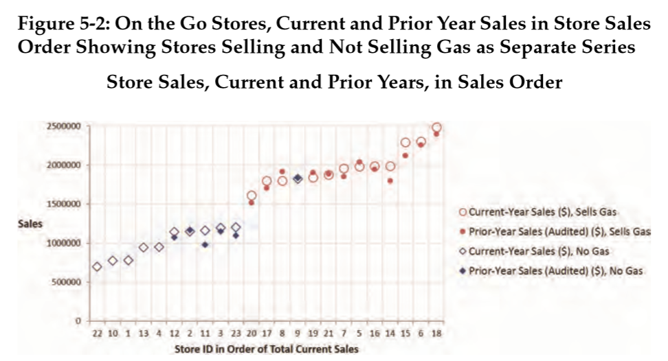
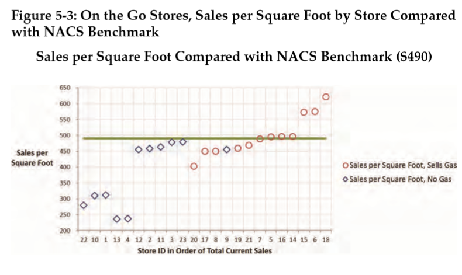
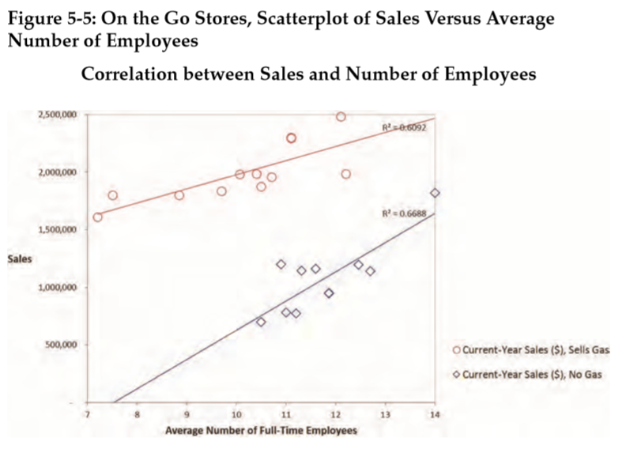

<!-- 

https://www.youtube.com/watch?v=UQ8fu9KtKFk 
     https://www.youtube.com/watch?v=DYsPRa3vpf0

-->

```{r setup, include=FALSE}
knitr::opts_chunk$set(echo = TRUE)
```

## **Introdução**

Neste _post_ nosso objetivo é mostrar como utilizar o R para implementar
visualização de dados em um contexto auditoria. Para isso vamos utilizar um
conjunto de dados apresentado no artigo **_Data Analytics for Financial 
Statement Audits_** de autoria de Trevor R. Stewart. Este artigo é um dos seis
que integram o livro [**Audit Analytics and Continuous Audit: Looking Towards the Future**](https://www.aicpa.org/interestareas/frc/assuranceadvisoryservices/downloadabledocuments/auditanalytics_lookingtowardfuture.pdf), disponível  para _download_ gratuitamente. 


O conjunto de dados está no arquivo `on_the_go_stores.xlsx` e é
também utilizado no Capítulo 3 do Guia de Auditoria da AICPA **_Analytical
Procedures_** onde, por meio de um estudo de caso, ilustra a aplicação de
procedimentos analíticos tanto no planejamento quanto na aplicação de 
testes substantivos.

Vamos trabalhar o exemplo denominado **Simple DA Visualization** 
apresentado no artigo em referência com o objetivo de **obter uma melhor
compreensão do ambiente de negócio da entidade** e **identificar riscos de erros
materiais**.

<aside>

O conjunto de dados `on_the_go_stores.xlsx` utilizado neste _post_ pode ser
obtido no reposítório [**Usando R em Auditoria**](https://github.com/marcosfs2006/Usando_R_em_Auditoria)

</aside>


No contexto de auditoria financeira a utilização de visualização de dados
tem sido cada vez mais enfatizada como técnica indispensável à adequada 
implementação dos **procedimentos analíticos**.

Na literatura mais tradicional de auditoria as técnicas mais comumente
citadas para utilização em procedimentos analíticos são:
**(a)** Análise de tendências, **(b)** Análise de quocientes, 
**(c)** Testes de razoabilidade,  e **(d)** Análise de regressão.

Modernamente essas técnicas podem ser ampliadas para incluir também  
técnicas que compõem o que se chama de **aprendizado de máquina**
(_machine learning_)


<aside>

A NBC TA 520 define Procedimentos Analíticos como "...avaliações de informações
contábeis por meio de análise das relações plausíveis entre dados financeiros
e não financeiros. (...) compreendem, também, o exame 
necessário de flutuações ou relações identificadas que são inconsistentes 
com outras informações relevantes ou que diferem significativamente
dos valores esperados."

</aside>


</br>

## **Descrição do conjunto de dados**

Os dados dizem respeito a uma cadeia de lojas de conveniência chamada 
**On the Go Stores**. A rede possui 23 lojas de conveniência localizadas no
sudeste dos Estados Unidos. Uma parte dos dados pode ser vista na figura a seguir:

</br>


</br>

Cinco das vinte e três lojas (lojas 1, 4, 10, 13 e 22) abriram durante o ano.
As operações variam em razão da localização geográfica e do mix de produtos
vendidos. A localização de uma loja baseia-se em diversos fatores tais como
a concorrência e o ambiente econômico da localidade.

De modo geral as operações de uma loja não mudam muito, a não ser que uma nova
linha de produtos seja introduzida, como por exemplo a venda de combustível,
desconto de cheques ou venda de bilhetes de loteria. O mix de produtos e 
serviços pode variar e o fator mais importante é se a loja vende combustível. 
Essas linhas de produtos adicionais em geral afetam o volume de clientes bem 
como o número de empregados trabalhando em horário integral.

</br>

## **Produção de gráficos** 


**Uso no contexto de conhecimento do negócio**

O que vamos fazer é tentar replicar os gráficos apresentados no artigo,
um dos quais é reproduzido a seguir:


</br>


</br>


Para tanto vamos utilizar o pacote `ggplot2` que integra o `tidyverse`.

Vamos carregar os pacotes necessários:

```{r}
library(readxl)
library(ggplot2)
library(tidyr)
library(forcats)
library(dplyr)
```

Agora vamos importar o conjunto de dados:

```{r}
stores <- read_excel("on_the_go_stores.xlsx")
head(stores)
```

Para a reprodução do gráfico, será necessário realizar uma pequena modificação
no conjunto de dados. Essa modificação consiste em transformar as colunas
`vendas_ano_anterior_aud` e `vendas_ano_corrente` em uma única variável que
chamaremos `periodo_vendas`. Para isso, vamos utilizar a função `pivot_longer()`
do pacote `tidyr`.

```{r}
stores_long <- stores %>%
                  pivot_longer(cols = c("vendas_ano_anterior_aud", "vendas_ano_corrente"),
                               names_to = "periodo_vendas",
                               values_to = "valor_vendas")

head(stores_long)
```

Feita essa modificação, o gráfico pode ser reproduzido da seguinte forma:

```{r}
ggplot(stores_long, aes(x=factor(store), y=valor_vendas)) + 
  geom_point(aes(shape=periodo_vendas, size=periodo_vendas), color="blue") +
  scale_shape_manual(values = c(1, 20)) +
  scale_size_manual(values = c(4, 3.5)) +
  theme_bw() +
  xlab("ID da Loja") + 
  ylab("Valor das Vendas") + 
  ggtitle("Vendas das Lojas - Ano Atual e Anterior")


```

O gráfico sugere haver um agrupamento das lojas em função da ordenação por ID.
É possível identificar os seguintes grupos de lojas: 1-4, 5-9, 10-13, 14-21 e
22-23.

Este aparente agrupamento das lojas pode ser resultado da localização das lojas
ou algum outro fator relacionado ao ID da loja ou simplesmente um padrão 
espúrio que emergiu por coincidência. Alguma investigação adicional será necessária.


O gráfico anterior pode ser modificado para que revele novas informações ao 
menos de duas outras formas. Em vez de plotar as vendas em função dos valores 
ordenados do ID das lojas pode-se plotar em função da ordenação dos valores das
vendas das lojas com menores vendas para as lojas com maiores vendas. Além 
disso, pelo fato de sabermos que as lojas que vendem combustível tendem a ter
um volume de vendas maior,  parece razoável distinguir as que vendem combustível
das que não vendem. O gráfico apresentado no artigo é o seguinte:

</br>



</br>

O código a seguir a mostra como incorporar as duas alterações propostas de 
forma a produzir um gráfico semelhante ao apresentado no artigo.

```{r}
ggplot(stores_long,
       aes(x=fct_reorder2(factor(store), periodo_vendas,valor_vendas, .desc = FALSE),
           y=valor_vendas)) + 
  geom_point(aes(shape=periodo_vendas,
                 size=periodo_vendas),
                 color="blue") +
  scale_shape_manual(values = c(1, 20)) +
  scale_size_manual(values = c(4, 3.5)) +
  theme_bw() +
  xlab("ID da Loja") + 
  ylab("Valor das Vendas") + 
  ggtitle("Vendas das Lojas - Ano Atual e Anterior")+
  facet_wrap(~ vende_gasolina, scales = "free_x") 

```

O gráfico nos mostra que as cinco lojas que abriram durante o ano não vendem 
combustível e estão entre as que possuem as menores vendas, conforme esperado. 
Também como esperado, as lojas que vendem combustível possuem um volume de 
vendas bem maior que as outras. Um exceção notável é a loja n. 9 que parece 
ter uma performance de vendas igual às lojas que vendem combustível, o que 
não é algo esperado. 

O auditor deve conferir para ver se a loja está corretamente classificada e, 
se confirmada que é uma loja que não vende combustível, tentar entender as 
razões sua performance tão superior às demais.

<br>

**Uso no contexto de testes de razoabilidade**

Seguindo ainda no exemplo contido no artigo em referência, outra aplicação
de visualização de dados é feita no âmbito da aplicação de um teste de 
razoabilidade pelo qual faz-se a avaliação das vendas em função da área das
lojas (vendas por unidade de área das lojas) comparando-se os valores obtidos
com um valor de referência ( $490 ) fornecido pela Associação Nacional das
Lojas de Conveniência (NACS, na sigla em inglês).

O gráfico apresentado no artigo é mostrado a seguir:



Para reproduzir o gráfico acima será necessário antes calcular o valor das
vendas por unidade de área da loja. Estas duas variáveis são `valor_vendas`
e `area_deposito`. A nova variável é o quociente de ambas.

```{r}
stores_long <- stores_long %>% 
  mutate(vendas_unid_area =  valor_vendas / area_deposito)
```

Agora o gráfico acima pode ser replicado conforme mostrado a seguir:

```{r}
stores_long %>% 
  filter(periodo_vendas == "vendas_ano_corrente") %>%
  mutate(vende_gasolina = factor(vende_gasolina)) %>% 
ggplot(aes(x=fct_reorder2(factor(store), periodo_vendas,valor_vendas, .desc = FALSE),
           y=vendas_unid_area)) + 
  geom_point(aes(shape=vende_gasolina), color="blue", size=4) +
  scale_shape_manual(values = c(1, 8)) +
  geom_hline( yintercept = 490, color="red", size=1 ) +
  theme_bw() +
  xlab("ID da Loja (Ordenado por Valor de Vendas)") + 
  ylab("Valor das Vendas por 'Square Foot'") + 
  ggtitle("Vendas por Unidade de Área das Lojas \n ( Comparação com Valor de Referência )")

```

O gráfico mostra que as cinco lojas que abriram durante o ano possuem os 
menores valores de vendas por unidade de área. Lojas que não vendem combustível
estão todas abaixo do valor de referência e três das que vendem combústível
estão bem acima do valor de referência.

<br>

A figura abaixo, também constante do artigo, mostra que a rotatividade do
estoque ( _vendas_ $\div$ _estoque_ ) é significativamente maior para as
lojas que vendem combustível (36 a 50 vezes) do que para as lojas que não 
vendem combustível (16 a 33 vezes).


Da mesma forma como feito para o gráfico anterior, será necessário criar uma
nova variável que indique a rotatividade do estoque. Isso é feito a seguir:

```{r}
stores_long <- stores_long %>% 
  filter(periodo_vendas == "vendas_ano_corrente") %>% 
  mutate(rotatividade = valor_vendas / inventario_ano_corrente)
```

Agora o gráfico pode ser replicado conforme mostrado a seguir:

```{r}
stores_long %>%
mutate(store = factor(store),
       vende_gasolina = factor(vende_gasolina)) %>%   
ggplot(aes(x = fct_reorder(store, valor_vendas, .desc = FALSE),
           y = rotatividade)) + 
  geom_point(aes(shape = vende_gasolina), color = "blue", size = 4) +
  scale_shape_manual(values = c(1, 8)) +
  theme_bw() +
  xlab("ID da Loja \n (Ordenado por Valor de Vendas no Ano Corrente)") + 
  ylab("Rotatividade do Estoque") + 
  ggtitle("Rotatividade do Estoque por Loja")

```

O gráfico evidencia que a rotatividade é significativamente maior para as lojas
que vendem gasolina do que para as que não vendem.


E para finalizar, o gráfico a seguir, mostra um diagrama de dispersão das
vendas em função do número de empregados. Quando o conjunto de dados é dividido
em dois subconjuntos com lojas que vendem combustível e das que não vendem 
verifica-se a existência de uma forte correlação, da ordem de 80% em cada 
caso, e o gráfico deixa claro que as lojas que vendem combustível possuem
um volume de vendas por empregado maior que as lojas que não vendem combustível.

Caso a análise fosse feita sem que os dados fossem dividos, o modelo de 
regressão não teria sido adequado e a correlação seria de apenas 15%. 
Este exemplo ilustra o seguinte ponto: **os auditores devem utilizar a 
análise de dados para obter uma clara compreensão dos mesmos antes de tentar
utilizar qualquer modelo.** 

O artigo apresenta o seguinte gráfico:
<br>



O código a seguir ilustra como obter o gráfico e modelos ajustados.

```{r}
# Correlação para as lojas que não vendem combustivel

stores_long %>% 
  filter(vende_gasolina == 0) %>% 
  select(qtd_media_empregados, valor_vendas) %>%
  cor()


```

```{r}
# Correlação para as lojas que vendem combustível

stores_long %>% 
  filter(vende_gasolina == 1) %>% 
  select(qtd_media_empregados, valor_vendas) %>%
  cor()

```


```{r}
stores_long %>% 
  mutate( vende_gasolina = factor(vende_gasolina)) %>%  
  ggplot(aes(x = qtd_media_empregados, y = valor_vendas, shape = vende_gasolina)) +
  geom_point( color = "blue", size = 4) +  
  geom_smooth(method = "lm", se=FALSE, color="red", formula = y ~ x) + 
  scale_shape_manual(values = c(1, 8)) +
  geom_text(x = 8,  y = 2250000, label = "r = 0.780", stats = "unique", color="red") +
  geom_text(x = 12, y = 1500000, label = "r = 0.817", stats = "unique", color="red") +
  theme_bw() +
  xlab("Qtd. Média de Empregados") + 
  ylab("Vendas") + 
  ggtitle("Correlação entre Vendas e Qtd. Empregados")


```

**Nota:** O artigo inclui no gráfico o coeficiente de determinação ($R^2$) do modelo
de regressão ajustado. Optei por incluir o coeficiente de correlação linear
entre as variáveis. 

O artigo conclui esclarecendo que as conclusões e _insights_ que o auditor pode
extrair da análise realizada irá depender de questões específicas da entidade
incluindo as expectativas do auditor. 

As visualizações auxiliam o auditor a perceber padrões e relacionamentos
e, ainda, eventuais resultados inesperados. Fica a cargo do auditor decidir,
com base no conhecimento que tem da entidade, o que é relevante e o 
que, se houver, deverá ser objeto de análise adicional. 

