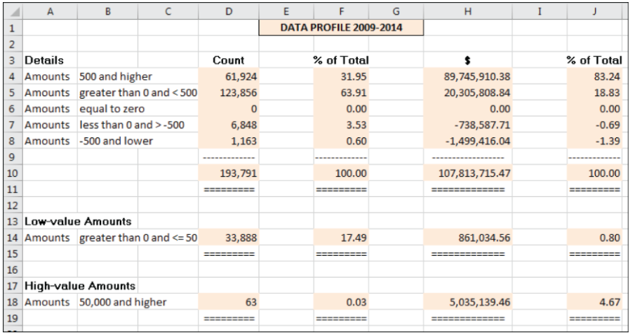
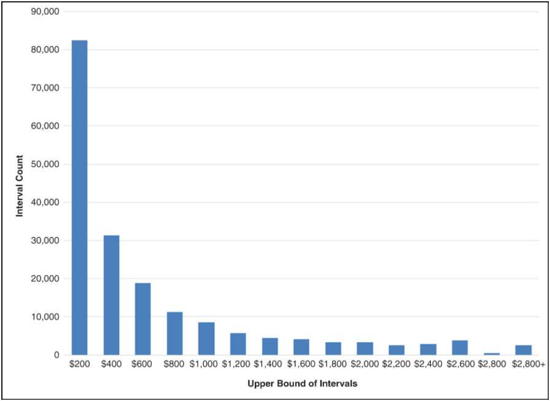
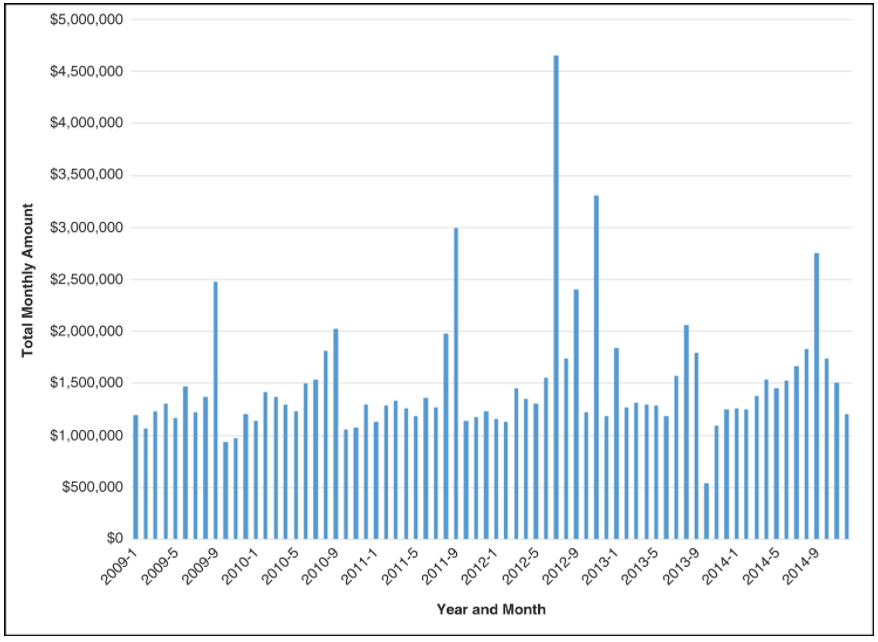
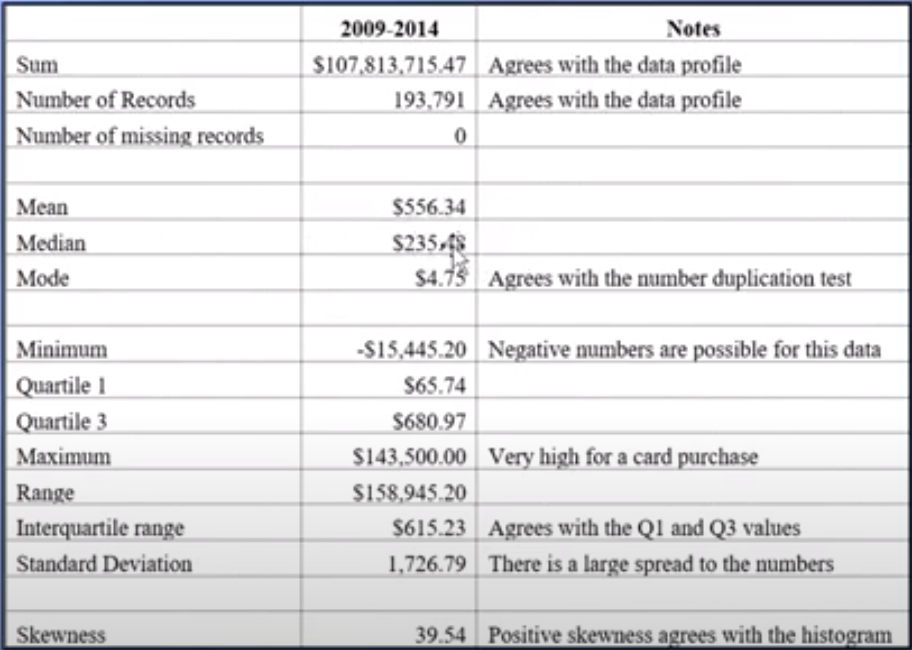

# **Introdução**

Neste _post_ nosso objetivo é mostrar como implementar no R as análises contidas
no capítulo 2 da segunda edição do livro [**Forensic Analytics**](https://www.amazon.com.br/Forensic-Analytics-Techniques-Accounting-Investigations-dp-1119585767/dp/1119585767/ref=dp_ob_image_bk) do Mark Nigrini.

Neste capítulo o autor apresenta o que ele chama dos "quatro testes de visão geral"
que tem por objetivo a obtenção de uma compreensão geral dos dados e eventualmente 
de alguns _insights_ para guiar análises posteriores.

Trata-se, essencialmente, da aplicação de  **Análise Exploratória de Dados** 
que deve preceder sempre qualquer análise de dados.

Esses "quatro testes" são os seguintes: **(a)** perfil dos dados, **(b)**
histograma, **(c)** gráfico de período e **(d)** estatísticas descritivas e, 
nos dizeres do autor, esses quatro testes formam a base de uma auditoria forense
orientada a dados.

O autor possui uma _playlist_ no YouTube onde faz uma rápida revisão dos 
capítulos do livro e o link a seguir é para o vídeo relativo ao Capítulo 2. 

https://www.youtube.com/watch?v=ibFG3Zn9-UQ&list=PLqQLvWWovXwUBF3YAbSGjUxKpgETwuRQR&index=4

Vamos mostrar como implementar no R cada um dos "testes" apresentados no
capítulo.


# **Importação dos dados**

O primeiro passo é realizar a importação dos dados que estão armazenados em
uma planilha do Excel chamada `PCard_Data2009-2014.xlsx`.

O conjunto de dados utilizado no capítulo diz respeito a transações realizadas
com cartões de crédito corporativo. Mais especificamente dados de compras 
do distrito de Columbia compreendendo o período de 2009 a 2014. 

Vamos importar os pacotes que precisaremos para nossas análises.

```{r}
library(readxl)
library(dplyr)
library(ggplot2)
```

Feita a importação dos pacotes, passamos à importação dos dados que, por estarem
armazenados em uma planilha do Excel, serão importados com a função `read_excel()`
do pacote `readxl`.


```{r}
# Impotação dos dados
pcard <- read_excel("PCard_Data2009-2014.xlsx")

# Inspeção dos dados
glimpse(pcard)
```

A saída da função `glimpse()` do pacote `dplyr` já nos fornece um conjunto
interessante de informações sobre esse conjunto de dados. De início já é
possível saber tratar-se de um conjunto de dados que possui 193.791 linhas
ou registros ou observações e 6 colunas ou variáveis.

Para cada variável temos informações sobre o tipo de dado de cada variável.
Por exemplo, a variável `Date` é do tipo data, a variável `Amount` é numérica e
todas as demais são caracteres.

Toda análise de dados requer que o analista conheça em bastante detalhes o que
cada variável significa. Vamos nos abster aqui de fazer maiores comentários
sobre os dados em razão do objetivo do _post_ não necessitar desse conhecimento.


# **Perfil dos dados**

A elaboração de um perfil dos dados, o que autor chama de "The Data Profile",
consiste, basicamente, em estratificar a base de dados em função dos valores da
variável de interesse, em geral o valor das transações ou dos saldos.

A estratificação consiste em se definir intervalos de valores dos dados e contar
a quantidade de registros que possuem valores em cada um dos intervalos definidos bem
como calcular a soma dos valores relativos aos registros classificados em cada
intervalo. 

Duas outras colunas consistem apenas em obter o percentual que cada
estrato representa do total geral tanto em termos da quantidade de registros,
como dos valores associados a cada estrato..

A figura a seguir, extraída do livro em referência, dá uma indicação do
contéudo do resultado do "teste".



Para obter os dados apresentados na tabela acima podemos fazer da seguinte forma:

```{r}
estratificacao <- pcard %>%
  mutate(estrato = case_when( Amount >= 500 ~ "(500, +Inf)",
                              Amount > 0 & Amount < 500 ~ "(0, 500)",
                              Amount == 0 ~ "0",
                              Amount > -500 & Amount < 0 ~ "(-500, 0)",
                              Amount <= -500 ~ "(-Inf, -500]")) %>% 
  group_by(estrato) %>% 
  summarise(qtd_registros = n(),
            vlr_estrato = sum(Amount)) %>% 
  ungroup() %>% 
  mutate(pct_registros = round(qtd_registros / sum(qtd_registros) * 100, 2),
         pct_vlr_estrato = round(vlr_estrato / sum(vlr_estrato) * 100, 2))

estratificacao
```

Por razões históricas, segundo o autor, o teste divide os dados em cinco 
estratos cobrindo todo o espaço de variação dos dados e a elaboração de mais
dois estratos cujo objetivo é mostrar os menores e maiores valores no 
conjunto de dados.

Na figura acima verifica-se que o autor optou por identificar a participação
dos registros cujos valores sejam positivos e menores ou iguais a 50 e os 
valores superiores a 50.000 para definir os estratos relativos aos maiores
e menores valores. 

A escolha desses valores é uma questão de sensibilidade do auditor e função do
contexto e características específicas dos dados em análise, não existindo
uma regra pré definida para a escolha dos mesmos.

A elaboração dos estratos suplementares segue a mesma lógica utilizada para
a criação da estratificação principal.

```{r}
extremos <- pcard %>% 
  mutate(extremos = case_when(between(Amount, 0.01, 50) ~ "(0, 50]",
                              between(Amount, 50000, +Inf) ~ "[50.000, +Inf]",
                              TRUE ~ "(50, 50.000)")) %>%  
  group_by(extremos) %>% 
  summarise(qtd_registros = n(),
            vlr_estrato = sum(Amount)) %>% 
  ungroup() %>% 
  mutate(pct_registros = round(qtd_registros / sum(qtd_registros) * 100, 2),
         pct_vlr_estrato = round(vlr_estrato / sum(vlr_estrato) * 100, 2)) %>% 
  filter(extremos != "(50, 50.000)")
  
extremos        

```


# **Histograma**

O segundo "teste" é o histograma, gráfico estatístico muito utilizado para avaliar
a distribuição de uma variável quantitativa contínua, que no âmbito das
auditorias usualmente são os valores das transações ou dos saldos.

A figura abaixo mostra o histograma apresenado no livro para o conjunto de dados
em análise. 



A produção de um histograma não é algo complicado de se fazer no R. Usando
o pacote `{ggplot2}` pode ser feito da seguinte forma:

```{r}

pcard %>%
  filter(between(Amount, 0, 3500)) %>% 
  ggplot(aes(x=Amount)) +
  geom_histogram(fill="blue", color="white")
```

Para a produção do histograma acima, foram excluídos os valores negativos e os
valores superiores a 3.500. Isso foi feito para melhorar a visualização dos
dado já que, incluindo os demais valores que são muito maiores ou muito 
menores que a grande maiorida dos dados a visualização ficaria prejudicada.

A função `summary()` nos dá uma visão geral da amplitude de variação
dos dados:

```{r}
summary(pcard$Amount)
```


# **Gráfico de período**

De acordo com o autor este é o terceiro "teste" geral usado para a obtenção de
_insights_ quanto a distribuição dos dados.

Essencialmente este gráfico, que o autor chama de "Periodic Graphic",  é uma série
temporal em que o autor fez a opção de mostrar a evolução temporal da quantidade
de interesse por intermédio de barras em vez de uma linha horizontals, o que 
seria o mais comum.

O teste consiste um dividir os dados em períodos de tempo, calcular o valor
de interesse para cada período e mostrar esses valores num gráfico onde o
período de tempo é mostrado no eixo `x` e os valores no eixo `y`. 

A figura a seguir é o gráfico apresentado pelo autor:



Esse gráfico pode ser obtido da seguinte forma:

```{r}
options(scipen = 999)

pcard %>% 
  mutate(ano_mes = format(Date, "%Y-%m")) %>% 
  group_by(ano_mes) %>% 
  summarise(total_mes = sum(Amount)) %>% 
  ggplot(aes(x=ano_mes, y=total_mes)) +
  geom_bar(stat="identity", color="white", fill="lightblue") +
  theme_bw() +
  theme(axis.text.x = element_text(angle = 90, vjust=0.3, size=5)) 
  
```

Algumas melhorias estéticas são ainda possíveis, mas essencialmente o gráfico
está pronto.


# **Estatísticas descritivas**

De acordo com o autor, o objetivo ao se calcular as estatísticas descritivas
é para auxiliar na avaliação quanto a existência de fraude ou erros nos dados
ou se houve mudanças no fenômeno mensurado.

As estatísticas descritivas apresentadas são as seguintes:

**Visão Geral**

* Soma dos valores (deve ser reconciliado com os registros contábeis)   
* Quantidade de registros   
* Quantidade de registros faltantes   

**Tendência Central**

* Média, mediana e moda   

**Variabilidade**

* Máximo, mínimo, intervalor interquartil, amplitude, desvio padrão   

**Medidas de assimetria**


A figura a seguir, retirada do livro em referência, apresenta o valor das
estatísticas para o conjunto de dados em análise.




Vamos ao cálculo dessas medidas:

A função `sum()` nos retorna a soma de um conjunto de valores.

```{r}
options(digits = 13)

sum(pcard$Amount)
```

A função `nrow()` nos retorna a quantidade de linhas que um conjunto de dados
no formato data frame possui.

```{r}
nrow(pcard)
```

A média e a mediana podem ser obtidas, respectivamente, com as funções `mean()`
e `median()`.

```{r}
mean(pcard$Amount) %>% round(2)
median(pcard$Amount)
```

Os valores mínimo e máximo podem ser obtidos, respectivamente, com as funções
`min()` e `max()`.

```{r}
min(pcard$Amount)
```

```{r}
max(pcard$Amount)
```


O range pode ser obtido a partir das funções `max()` e `min()`.

```{r}
max(pcard$Amount) - min(pcard$Amount)
```

Quartis, decis e percentis podem ser obtidos com a função `quantile()`, 
Especificamente o primeiro e terceiro quartis são calculados como mostrado
a seguir:

```{r}
quantile(pcard$Amount, probs=c(0.25, 0.75))
```

A função `IQR()` calcula O intervalo interquartil.

```{r}
IQR(pcard$Amount)
```

O desvio padrão pode ser calculado com a função `sd()`.

```{r}
sd(pcard$Amount) %>% round(2)
```

Não apresentamos as funções para o cálculo da moda e da assimetria. O R não 
possui funções nativas para o cálculo dessas quantidades e seria necessário
usar um pacote para isso.

A moda não é uma medida em geral utilizada nas análises. Uma percepção melhor
desse valor pode ser obtida por intermédio de visualizaões dos dados. O próprio
desvio padrão não é uma medida de fácil interpretação.

O coeficiente de variação é uma medida muito utilizada para se avaliar a
representatividade da média em um conjunto de dados.

Também não são muito utilizadas medidas de assimetria. Uma boa opção é utilizar
[gráficos de quantis ("QQ-plot")](https://pt.wikipedia.org/wiki/Gr%C3%A1fico_Q-Q)
para avaliar o quanto uma distribuição se "aproxima" de uma distribuição de
referência, em geral a distribuição normal.


# **Conclusão**

A **Análise Exploratória de Dados** é uma etapa essencial em qualquer trabalho
com dados e não seria diferente com a **Forensic Analytics**.

Os "testes" apresentados no Capítulo 2 representam uma pequena fração do que
pode ser feito nessa etapa. Talvez em outra postagem possamos apresentar outras
possibilidades de análise além das que são apresentadas no texto de referência.

Os dados faltantes ou _missing values_ são um aspecto importante a ser 
considerado na análise preliminar dos dados mas que não foi abordado
no capítulo 2 do livro.

Um aspecto positivo na abordagem apresentada no livro é a importância dada
à visualização de dados. Com os recursos computacionais hoje disponíveis não
há porque negligenciar sua utilização nos  trabalhos de auditoria. Confiar
apenas em medidas numéricas descritivas não é uma boa opção.

Como o leitor deve ter pecebido, não houve preocupação em colocar as tabelas 
produzidas em um formato que fosse adequado para constar de um relatório.
Procuramos apenas mostrar a implementação dos testes usando o R.

O mesmo podemos dizer dos gráficos. Vários recursos de customização estão
disponíveis para tornar os gráficos visualmente mais agradáveis, o que é
essencial para a produção de relatórios mas que não tem tanta relevância
quando estamos apenas fazendo exploração dos dados.

Em algum momento vamos fazer um _post_ tratando especificamente da produção
de tabelas no R, visto ser um tópico relevante quando se trata de elaborar
relatórios.

Então é isso. Espero que tenham gostado!
