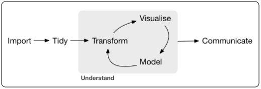

# **Introdução**

A ideia desse _post_ surgiu após a leitura de alguns capítulos do livro
**Forensic Analytics** do Mark Nigrini para a elaboração do _post_ intitulado
"Uma Implementação em R do RSF Test".

Na primeira edição do livro (atualmente o livro está em sua 2^a^ edição) 
os três primeiros capítulos são intitulados, respectivamente, "Usando Access
em Investigações Forenses", "Usando Excel em Investigações Forenses" e
"Usando PowerPoint em Apresentações Forenses" e meu objetivo com este _post_ é
mostrar que o R possui muito mais condições de ser **a** ferramenta
para implementação não só dos procedimentos descritos na literatura de
"forensic analytics" mas também das diversas outras técnicas de mineração de
dados descritas na literatura de detecção de fraudes. 

Além disso o R oferece ótimos recursos para apresentação dos resultados, tanto na
forma de relatórios como de painéis ( _dashboards_ ) e de apresentações. 

Logo no início do Capítulo 1 Nigrini afirma que são quatro os principais 
passos em auditoria forense:

1. obtenção dos dados;
1. preparação dos dados;
1. análise dos dados e
1. reporte dos resultados

Na verdade, essas etapas são comuns a todos os projetos de análise de dados. No 
livro [**R for Data Science**](https://r4ds.had.co.nz/index.html) o autor 
apresenta o seguinte _framework_ para o trabalho com dados:

Este processo engloba as etapas mencionadas por Nigrini como pode ser facilmente
visto na figura.

O R, como será mostrado mais adiante, possui excelentes recursos para uso
em todas as quatro etapas mencionadas pelo autor.

Nos capítulos que se seguem, mostramos os recursos que o R ofecere para a
execução de cada uma das etapas. 

Os recursos a que nos referimos são **funções** disponibilizadas por meio de 
 **pacotes**. Esses são dois conceitos importantes para o trabalho com o R.

No R, diferentemente de outros aplicativos, o usuário em geral irá digitar na
linha de comando as **funções** que ele deseja utilizar para realizar uma 
determinada tarefa. Isso não é muito diferente do que o usário faz ao inserir
uma função numa célula de uma planilha, por exemplo, para realizar um cálculo
qualquer ou outra ação de interesse.

As funções estão reunidas em **pacotes**. Por exemplo, o pacote `{readxl}` 
disponibiliza funções úteis para a importação de dados armazenados em planihas
do Excel. Da mesma forma, outros pacotes irão disponibilizar funções escritas 
para relizar determinado tipo de tarefa.

Uma coisa interessante no R é que qualquer usuário pode criar suas próprias
funções e disponibilizar para que outras pessoas possam também utilizá-las.
Essa facilidade de extender as funcionalidades básicas do R é uma das coisas 
que o tornam bastante popular.

# **Forensic Analytics**

O objetivo da auditoria financeira é disponibilizar aos usuáios das
demonstrações financeiras uma opinião quanto à adequada apresentação das
mesmas em todos os aspectos materiais e de acordo com normas que orientam sua
elaboração. A finalidade é, então, fornecer aos interessados algum grau
de confiança nas demonstrações fnanceiras objeto de análise.

Ainda que a **Forensic Analytics** guarde bastante similaridade com a auditoria
financeira, dela se diferencia pelo fato de ter por objetivo **identificar**
(detecção) erros intencionais e não intencionais e os vieses nos dados objeto
de análise.

As circunstâncias em que a Forensic Analytics é utilizada caracteriza-se pela
ação **pró-ativa** da entidade buscando pela ocorrência de fraudes e outras
anomalias (abuso e desperdício) ou ainda em situações em que a fraude foi
descoberta e objetiva-se avaliar a extenção da mesma e se outros esquemas
semelhantes estão em operação.

As principais abordagens utilizadas em Forensic Analytics, segundo
Nigrini, são os testes de alto nível (análise preliminar dos dados), os
testes de duplicação excessiva de dígitos, testes para números redondos, testes para
_outliers_ e testes para mudanças no padrão temporal dos dados. 

As ferramentas apresentadas no livro de Nigrini e também no livro 
**Fraud and Fraud Detection** de Sunder Gee, baseadas na aplicação dos testes
acima mencionados bem como em outros do gênero, diferem bastante da abordagem
feita, por exemplo, no livro **_Fraud Analytics: Using Descriptive, Predictive,
and Social Network Techniques - A Guide to Data Science for Fraud Detection_**,
de Bart Baesens, Veronique Van Vlasselaer e Wouter Werbeke, que propõe o uso
de técnicas de aprendizado de máquina como ferramentas para detecção de fraudes.

Claramente o R tem muito mais a oferecer na implementação de técnicas de _machine
learning_ do que o Excel e o Access.

A propósito, destacamos que na 2^a^ edição de seu livro, Nigrini já traz
implementações de algumas das técnicas apresentadas no livro usando também
o IDEA, R, SAS, Tableau e Minitab.

Especificamente em relação ao R o autor menciona que "_(...) R é um programa
flexível capaz de fazer virtualmente qualquer coisa relacionada à análise de
dados, e para tanto utiliza uma interface baseada em linha de comando e sua
própria sintaxe e linguagem de programação_"

Boa parte do que é discutido no Capítulo 2 da 2^a^ edição do livro de Nigrini é
abordado em outros contextos como **Análise Exploratória de Dados** e o R oferece 
excelentes recursos para a execução desses procedimentos que em essência tem
por objetivo a obtenção de uma visão geral e compreensão dos dados em análise.

Vamos agora dar uma olhada nos recursos que o R tem a oferecer para a execução
de cada uma das etapas da auditoria forense mencionadas por Nigrini.

# **Obtenção dos Dados**

A importação dos dados é sem dúvida uma etapa crítica no processo de análise.
Os dados estão armazenados em arquivos e estes podem ser de diversos tipos, o
que impõe ao usuário alguns desafios a depender do tipo de arquivo. Por exemplo,
importar dados armazenados em arquivos `.csv` é bem mais fácil do que importar
dados armazenados em arquivos `.pdf`.

Existem diversos pacotes no R que disponibilizam funções para acessar dados
armazenados em diversos formatos, sejam abertos ou proprietários.

Vamos listar a seguir alguns pacotes disponíveis e dar a indicação dos tipos de
arquivos a que se destinam:

Pacote | Tipo de arquivo
-------|-------------------
[`{readxl}`](https://readxl.tidyverse.org/) | planilhas do Excel. 
[`{readr}`](https://readr.tidyverse.org/)  | arquivos texto em geral. 
[`{haeven}`](https://haven.tidyverse.org/) | arquivos dos softwarre estatísticos SAS, SPSS e Stata
[`{rio}`](https://github.com/leeper/rio)    | diversos tipos de arquivo, incluindo os acima mencionados
`{jsonlite}` |arquivos json
`{xml2}` | arquivos xml e html

Além desses, existem pacotes que possibilitam o acesso a bancos de dados como
os pacotes `{DBI}`, [`{odbc}`](https://db.rstudio.com/), `{RSQLite}` dentre diversos outros.

A obtenção de dados em páginas web mediante um procedimento conhecido por
_web scraping_ ou "raspagem de dados" pode ser feito com o pacotes `{rvest}` em 
combinação outros pacotes.

Dados disponibilizados em APIs podem ser obtidos com o pacote `{httr}`.

Naturalmente existem muitos outros pacotes disponíveis, mas com estes já é 
possível fazer muita coisa. 

# **Preparação dos Dados**

De forma bem simples, a etapa de preparação dos dados consiste em colocá-los
em condições de serem submetidos à modelagem ou aos testes como os discutidos
nos livros já citados, ou ainda serem visualizados, após sua importação. 

Isso implica que os dados, em geral, após serem importados precisam ser "limpos" e
precisam ter sua consistência e integridade avaliados.

Em relação à preparação e organização dos dados recomendamos a leitura
dos artigos `Tidy Data` do Hadley Wickham e `Data Organization in Spreadsheets` de 
de Karl W. Broman & Kara H. Woo.

Essa é muitas vezes uma etapa demorada e ter à disposição ferramentas adequadas
que permitem o tratamento dos dados de forma simples faz muita diferença, e aqui
é onde o R realmente brilha!

Para realizar essa etapa de forma eficiente o R disponibiliza um
amplo conjunto de pacotes e funções dos quais mencionaremos apenas o que mais
utilizamos, sendo certo que muitos outros existem e podem ser tão bons ou
melhores que os aqui elencados.

Podemos iniciar com os pacotes que integram o denominado `{tidyverse}`. Da 
página (https://www.tidyverse.org/) deste "metapacote" tira-se a seguinte 
"definição": "**_The tidyverse is an opinionated collection of R packages 
designed for data science. All packages share an underlying design philosophy, 
grammar, and data structures._**

Trata-se de um **conjunto de pacotes** projetados para fazer **ciência de dados**
o que claramente compreende o tipo de tarefa que encontramos na literatura
de _Forensic Analytics_ ou mesmo de _Audit Data Analytics_.

Também vale a pena destacar que os pacotes compartilham uma filosofia comum
acerca da abordagem de análise de dados que integra a estrutura de dados
utilizada e um conjunto de regras definindo como essa estrutra deve ser manipulada.

Os pacotes que integram o `{tidyverse}` básico são:

* [`{dplyr}`](https://dplyr.tidyverse.org/) - manipulação de dados;   
* [`{ggplot2}`](https://ggplot2.tidyverse.org/) - produção de gráficos;   
* [`{stringr}`](https://stringr.tidyverse.org/) - manipulação de dados textuais;   
* [`{tidyr}`](https://tidyr.tidyverse.org/) - organização dos dados;     
* [`{readr}`](https://readr.tidyverse.org/) - importação de dados;    
* [`{purrr}`](https://purrr.tidyverse.org/) - programação funcional;      
* [`{tibble}`](https://tibble.tidyverse.org/) -  extenção dos data frames;      
* [`{forcats}`](https://forcats.tidyverse.org/) - manipulação de dados categóricos expressos como fatores 

Um outro pacote importante que não integra o `{tidyverse}` básico é o 
[`{lubridate}`](https://lubridate.tidyverse.org/) que destina-se à manipulação
de datas e horas.

Às vezes será necessário manipular uma grande quantidade de dados que não podem
ser alocados na memória do computador, e para ajudar resolver esse problema 
alguns pacotes estão disponíveis, dentre os quais citamos: `{sparklyr}` e
`{disk.frame}`.

# **Análise dos dados**

Para efetivamente realizar a análise dos dados, aqui entendida como a modelagem
dos mesmos, também existem diversos outros pacotes, além dos que já foram
mencionados nas seções precedentes, que podem auxiliar nessa tarefa.

Dada a ampla gama de possibilidade de modelagem, vamos remeter o leitor 
para a página de alguns livros disponíveis _online_ para que o leitor 
veja algumas possibilidades oferecidas pelo R:

* [Audit Analytics with R](https://auditanalytics.jonlin.ca/)    
* [Tidy Modeling with R](https://www.tmwr.org/)   
* [Text Mining with R](https://www.tidytextmining.com/)   
* [Fundamentals of Data Visualization](https://clauswilke.com/dataviz/)  

Os exemplos acima apenas dão uma rápida visão das possibilidades que o R pode
oferecer nessa área.

Um site interessante é o <https://bookdown.org/> que disponibiliza _online_  
livros sobre o R de forma gratuita em sua grande maioria.
O [**The Big Book of R**](https://www.bigbookofr.com/index.html) do Oscar Baruffa
é outro site na mesma linha.

O livro [Audit Analytics: Data Science for the Accounting Profession](https://github.com/westland/auditanalytics)
mostra o uso do R como ferramenta analítica num contexto puramente de auditoria.
Aparentemente é o primeiro livro publicado nessa linha.

# **Comunicação dos Resultados**

Nos trabalhos de auditoria essa é uma etapa fundamental sem a qual
as etapas anteriores talvez não produzam os resultados esperados por melhor
que tenham sido realizadas, visto que se os destinatários das análises não
tomarem conhecimento dos resultados obtidos talvez nenhuma ação com base no
trabalho realizado seja tomada.

Os resultados obtidos podem ser apresentados por intermédio de relatórios, 
painéis ou apresentações. Veremos o que o R tem a oferecer para cada
um desses formatos de comunicação.

### **Relatórios**

Para a produção de relatórios o R apresenta um conjunto de opções que se
fundamentam numa ferramenta básica: o [**markdown**](https://pt.wikipedia.org/wiki/Markdown). 

O pacote [`{rmarkdown}`](https://rmarkdown.rstudio.com/) oferece a infraestrutura
básica sobre a qual outros pacotes mais especializados são construídos. 
Essencialmente o `{rmarkdown}` possibilita que texto e código em R (atualmente 
também Python e SQL) sejam combinados em um único arquivo `.Rmd` para a produção de
um documento que pode ser um `html`, um `pdf`, ou um `docx` para citar os mais
comuns. 

Para conhecer um pouco mais de rmarkdown recomendamos a leitura do texto
[RMarkdown: O mínimo que você precisa saber](https://medium.com/rladiesbh/rmarkdown-o-m%C3%ADnimo-que-voc%C3%AA-precisa-saber-1cb1bb57769d)

Mais recentemente uma outra ferramenta chamada [Quarto](https://quarto.org/) 
(também baseada em rmarkdown) foi incorporada ao conjunto de ferramentas
disponíveis para a produção de textos.

Pacotes como o `{pagedown}` e o [`{pagedreport}`](https://pagedreport.rfortherestofus.com/),
também facilitam muito a produção de relatórios.

Também os pacotes `{officer}` e [`{officedown}`](https://github.com/davidgohel/officedown)
podem ser usados para a produção de documentos em Word ou PowerPoint a partir
de documentos escritos em rmarkdown.

Para mais informações sobre esses pacotes e alguns outros consultar
<https://ardata-fr.github.io/officeverse/>

A criação de tabelas é um elemento essencial nos relatórios e também aqui o R
tem muito a oferecer. A função `kable()` do pacote `{knitr}` pode ser usada 
para criar tabelas mais básicas e caso haja a necessidade de elaborar tabelas 
mais complexas os pacotes `{kableExtra}`, `{gt}` e `{flextable}`, para citar
apenas três, podem dar conta do recado. Mas vários outros estão disponíveis
para essa finalidade.

### **Painéis**

É cada vez mais comum que os resultados de análises sejam mostrados não só 
atrávés de relatórios, mas também de painéis ou, como gostam alguns, _dashboards_.

Os pacotes [`{flexdashboard}`](https://pkgs.rstudio.com/flexdashboard/),
`{shinydashboard}` e [`{shiny}`](https://shiny.rstudio.com/) disponibilizam 
recursos para a construção de painéis estáticos ou interativos. 

Os gráficos dinâmicos são elementos essenciais nesses "artefatos" e pacotes
como o [`{plotly}`](https://plotly.com/r/), [`{echarts4r}`](https://echarts4r.john-coene.com/),
[`{leaflet}`](https://rstudio.github.io/leaflet/), [`{dygraphs}`](https://rstudio.github.io/dygraphs/),
[`{highcharter}`](https://jkunst.com/highcharter/),
[`{gganimate}`](https://gganimate.com/), [`{visNetwork}`](https://datastorm-open.github.io/visNetwork/) [`{networkD3}`](https://christophergandrud.github.io/networkD3/),
[`{rAmCharts}`](https://datastorm-open.github.io/introduction_ramcharts/) podem ser muito úteis.

### **Apresentações**

As apresentações são, também, uma forma muito comum de apresentação dos resultados
e também aqui o R oferece excelentes opções. Além dos pacotes `{officer}` e
`{flexdashboard}` já citados, o pacote [`{xaringan}`](https://github.com/yihui/xaringan)
possibilita a criação de apresentações no formato html.

Para uma visão geral do `{xaringan}` recomenamos ao leitor dar uma olhada
nesse material da Bia Milz: <https://beatrizmilz.com/talk/2021-3rday-xaringan/>.

# **Outros pacotes de interesse**

Além dos pacotes acima mencionados, alguns outros podem ser usados para implementar
técnicas típicas de _Forensic Analytics_. Por exemplo, os pacotes
[`{benford.analysis}`](https://github.com/carloscinelli/benford.analysis) e
`{benford}` e `{BenfordTests}` implementam análises baseadas na Lei de Benford.

Para a detecção de _outliers_ também existem algumas opções, uma delas sendo o
pacote `{outliers}`.

# **Considerações Finais**

A popularidade do Excel entre os profissionais de área de auditoria é 
certamente a razão de ser a ferramenta escolhida para a implementação das
técnicas apresentadas no livro, apesar de suas limitações para realização
de análise de dados.

O R, por outro lado, apesar de oferecer enormes vantagens, não é uma ferramenta
popular entre os profissionais de auditoria, ao menos por enquanto. 

Comparado ao Excel o R possui, certamente, uma curva de aprendizado mais longa,
exigindo uma dedicação muito maior para o seu aprendizado o que por vezes pode
tornar-se uma barreira intransponível.  Por outro lado, uma vez vencida essa
dificuldade inicial, esse esforço adicional acaba por ser compensado em razão
da eficiência que se obtém na realização das tarefas de análise de dados. 

O uso do R traz como um benefício adicional a possibilidade de **reprodutibilidade**
das análises realizadas, já que todo o código utilizado para a realização das
análises fica disponível, possibilitando a qualquer pessoa replicar
o que foi feito, o que não é tão simples quando de usa uma planilha eletrônica.

Bem, era isso. Espero que tenham gostado.
