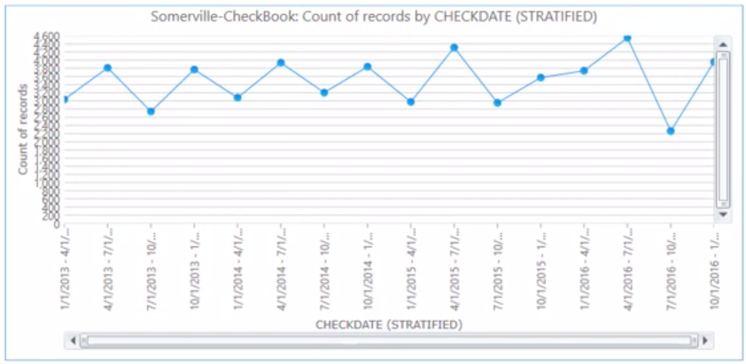

# **Introdução**

Nosso objetivo neste _post_ é tentar repoduzir as análises feitas por Mark
Nigrini em seu _workshop_ na Conferência de Usuários do Software IDEA ocorrido
em 1^o^ de outubro de 2020.

As análises podem ser vistas no [vídeo](https://www.youtube.com/watch?v=O0mAZOKR69s&t=589s)
disponibilizado pelo autor em seu canal do YouTube.

Os materiais utilizados no vídeo em referência podem ser baixados no link: https://www.dropbox.com/sh/8g8ox3cs8po25tw/AACUfFFtZPUW4g6Co1yBClGwa?dl=0

Os arquivos também estão disponíveis no repositório
[Usando R em Auditoria](https://github.com/marcosfs2006/Usando_R_em_Auditoria)
no arquivo `ForensicAnalytics2nd_IDEA.zip`.

Os documentos disponibilizados pelo autor são os seguintes:

1. `Nigrini_FraudNumbers_HandsOn.docx`   
1. `Hands-On_Notes.docx`    
1. `Somerville_2013-2016.xlsx`   
1. `SampleMeans.pptx`   

O primeiro documento contém a descrição das análises realizadas e os dados
utilizados estão contidos no arquivo indicado no terceiro item. Os outros dois
são documentos auxiliares sem maior importância.

Este _post_ refere-se à Parte I. A nossa **intenção** para uma possível 
Parte II seria mostrar as análises feitas no IDEA contidas em 3 vídeos
disponíveis no YouTube nos quais são mostradas as análises descritas
no documento **CI202 IDEA Data Analysis Workbook**. 


# **Base de Dados**

Os dados referem-se a pagamentos feitos pela cidade de Somerville nos
anos de 2013 a 2016 e possuem os seguintes campos:


**`ID`**: identifica de forma única cada pagamento   
**`GovCategory`**: indica o setor que realizou a transação 
podendo ser 'Education', 'General Government', ou 'Public Works', as três divisões
que fazem pagamentos na cidade de Somerville    
**`VendorName`**: informa o nome do fornecedor para o qual o pagamento foi feito    
**`Amount`**: valor do pagamento realizado       
**`CheckDate`**: data de emissão do cheque de pagamento   
**`Department`**: nome do departamento para o qual a compra foi realizada   
**`CheckNum`**: número dos cheques emitidos em numeração sequencial   
**`OrgDescription`**: detalhes adicionais sobre o departamento    
**`AcctDescription`**: mais detalhes sobre o tipo de despesa   

Na seção seguinte vamos elencar as tarefas requeridas e mostrar como 
executá-las no R.


# **Tarefas**

As "tarefas" a serem executadas nos dados estão descritas no documento
`Nigrini_FraudNumbers_HandsOn.docx`.

As tarefas solicitadas são as seguintes:

### **Tarefa 1**

Importe os dados e mostre apenas os 10 primeiros registros das quatro
primeiras variáveis (`ID`, `GovCategory`, `VendorName` e `Amount`).


Vamos carregar os pacotes necessários. Estamos assumindo que todos já estejam
instalados.

```{r}
# Carregando os pacotes necessários
options(digits = 12, scipen = 999)
library(readxl)
library(dplyr)
library(stringr)
library(lubridate)
library(ggplot2)
library(benford.analysis)
```

A importação dos dados pode ser feita da seguinte forma:

```{r}
somervile <- read_excel("Somerville_2013-2016.xlsx")
```

Uma rápida olhada nos dados:

```{r}
glimpse(somervile)
```

Mostrar os 10 primeiros registros da base de dados

```{r}
somervile %>% 
  select(ID:Amount) %>% 
  slice_head(n=10)
```
Importados os dados é sempre necessário conferir se os mesmos estão completos, 
ou seja, se não está faltando nenhum registro, e uma forma clássica de se 
fazer isso é "totalizar" a base de dados e conferir o valor obtido com os
registros contábeis da entidade auditada.

```{r}
sum(somervile$Amount)
```

No documento `Hands-On_Notes.docx` o autor informa que os "Totais de Controle"
são: \$677,014,836.63 e 55.746 registros. Aparentemente está tudo ok.


### **Tarefa 2**

Crie um gráfico de período para o valor total pago por mês (Janeiro de 2013
a Dezembro de 2016).

A elaboração de um gráfico de período foi vista no _post_ "Análise Exploratória
de Dados e _Forensic Analytics_".

```{r}
somervile %>% 
  mutate(AnoMes = format(CheckDate, "%Y-%m")) %>% 
  group_by(AnoMes) %>% 
  summarise(TotalMes = sum(Amount)) %>% 
  ggplot(aes(x=AnoMes, y=TotalMes)) +
  geom_bar(stat="identity", color="white", fill="lightblue") +
  theme_bw() +
  theme(axis.text.x = element_text(angle = 90, vjust=0.3, size=5)) 
```

### **Tarefa 3**

Qual mês/ano no período de janeiro de 2013 a dezembro de 2016
possui o maior valor de pagamentos em todo o período? 

O gráfico mostra que a resposta a esta questão é **junho de 2016**. Também
seria possível obter esta resposta da seguinte forma:

```{r}
somervile %>%
  mutate(AnoMes = format(CheckDate, "%Y-%m")) %>% 
  group_by(AnoMes) %>%
  summarise(TotalMes = sum(Amount)) %>% 
  slice_max(TotalMes)
  
```


### **Tarefa 4**

Calcular os valores abaixo relacionados, mostrando-os em oito linhas
consecutivas. Arredonde os valores para duas casas decimais. 

Valores a serem calculados: soma, quantidade de registros, número de registros
faltantes, média, mediana, moda, valor mínimo e valor máximo.

```{r}

edescr <- somervile %>% 
  summarise(Soma = sum(Amount),
            QtdReg = n(),
            Media = mean(Amount),
            Mediana = median(Amount),
            Minimo = min(Amount),
            Maximo = max(Amount))

edescr %>% t() %>% round(2)                     

```

Ficaram de fora a moda e o número de registros faltantes. No vídeo, o autor
faz o cálculo da moda tabulando a frequência de ocorrência de
cada número, ordenando e verificando o número com a maior frequência de ocorrência,
algo assim:

```{r}
somervile %>%
  count(Amount) %>% 
  slice_max(n=1, order_by=n)
```

Embora o R não possua uma função nativa para o cálculo da moda, alguns pacotes
fornecem funções para o seu cálculo, como por exemplo a função `Mode()` do
pacote `{pracma}`.

O número de registros faltantes não foi calculado em razão de não ter uma
indicação no vídeo, nem no livro, de como obter esse valor. Mas em princípio
se a totalização dos valores na base de dados confere com o que está registrado
na contabilidade, então não há registros faltantes. 

Uma outra possibilidade seria explorar a numeração sequencial dos cheques para
verificar se existe lacunas. Vamos deixar isso para mais adiante.


### **Tarefa 5** 

Este item está faltando no documento disponibilizado pelo autor,


### **Tarefa 6**

A média dos valores do conjunto de dados (todos os 55.746 pagamentos)
é \$12.144,64. Você esperaria que o valor médio dos pagamentos de uma
amostra de 200 registros seja igual a esse valor? Se não, você esperaria que
seja superior ou inferior a \$12,144.64

No documento `SampleMeans.pptx` o autor apresenta um pouco da teoria 
relacionada à distribuição amostral da média. A leitura do último _slide_
nos permite responder à questão. 

A média amostral é um estimador não viesado da média populacional, e para 
amostras maiores que 30 a distribuição amostral da média aproxima-se bastante
de uma distribuição normal independentemente da distribuição populacional da
qual a amostra foi retirada. A média dos valores de uma amostra de 200
elementos da população irá ficar próxima à média de todos os valores da
base de dados (população). Em algumas amostras essa média será inferior, em
outras será superior à média populacional.


### **Tarefa 7**

Você espera que os dados de pagamento se conformem à Lei de Benford? Porque?  

Sim. Em geral os dados contábeis contém as características necessárias a que
um conjunto de valores se ajuste à distribuição de dígitos preconizada pela
Lei de Benford.


### **Tarefa 8** 

Aplique o teste dos dois primeiros dígitos ao conjunto de dados. Apresente o
gráfico do teste realizado.

```{r}
somervile_bfd <- benford(somervile$Amount, discrete = FALSE)
plot(somervile_bfd,
     multiple=FALSE,
     except = c("second order", "summation", "mantissa", "chi square", "abs diff", "ex summation"))

```


### **Tarefa 9** 

Qual o nível de conformidade que os dados apresenetam com a Lei de Benford?
Use o desvio médio absoluto (MAD - _mean absolute deviation_) para o teste de
dois dígitos. A resposta deve ser: "conformidade estrita", "conformidade aceitável",
"conformidade marginalmente aceitável", ou "não conforme".

Para responder de forma adequada a essa questão, é necessário conhecer o critério
para se fazer a classificação solicitada no exercício. Observando o vídeo  
indicado por volta do minuto 15:51 o autor remete para a página 114 de seu 
livro _Forensic Analytics_ onde consta uma tabela que permite fazer a 
classificação em função do valor do  MAD obtido.

```{r}
somervile_bfd
```

O resultado acima mostra que o conjunto de dados possui uma conformidade marginal
à Lei de Benford. (_Marginally acceptable conformity_)


### **Tarefa 10**

Identifique os dois primeiros dígitos (10, 11, …, 99) que possuem os três
maiores valores no gráfico, ou seja, o par de dígitos que mais excedam a
proporção esperada. 

O resultado do item anterior nos mostra que os dígitos são: 50, 13 e 15. Não obstante, 
esses valores diferem dos que são obtidos pelo autor no vídeo: 50, 75 e 78.

Não conseguimos checar a origem da divergência, mas possivelmente deve-se ao
critério utilizado para avaliar o distanciamento dos dígitos ao valor esperado.


### **Tarefa 11**

Identifique os pagamentos "redondos" na base de dados. Um número redondo
é definido como sendo um múltiplo de 100.000. Mostre uma tabela com os números
redondos identificados mostrando as colunas `CheckDate`, `VendorName`, `Amount` e
`AcctDescription`. 

Ordene o resultado de forma decrescente em função da coluna `Amount`. 

Calcule a percentagem de números redondos no total de registros
da base de dados. Forneça o resultado no formato xx.xx%.

```{r}
num_redondo <- somervile %>% 
  mutate(NumRedondo = if_else(Amount != 0 & 
                              Amount %% 1e5 == 0, 1, 0)) %>% 
  filter(NumRedondo == 1) %>% 
  arrange(Amount) %>% 
  select("CheckDate", "VendorName", "Amount", "AcctDescription")

head(num_redondo)
```
Cálculo do percentual de registros relativos a números redondos.

```{r}
round(nrow(num_redondo) / nrow(somervile) * 100, 2) %>% 
  paste0("%")
```


### **Tarefa 12**

Crie uma nova coluna na base de dados (`DayWeek`) contendo o dia da 
semana a que se refere o pagamento (`CheckDate`). Assim, por exemplo, se a 
data do cheque é 2/1/2013, que é uma quarta-feira, o valor da nova coluna
será "4". 

Exclua as colunas `OrgDescription` e `AcctDescription`. Mostre as
8 primeiras linhas do resultado obtido que deve incluir a coluna recém criada
`DayWeek`.


```{r}
somervile <- somervile %>% 
  mutate(DayWeek = wday(CheckDate)) 

somervile %>% 
  select(-OrgDescription, -AcctDescription) %>% 
  slice_head(n=8)
```


### **Tarefa 13**

Calcule a quantidade de cheques emitidos em cada dia da semana. Algum cheque
cuja data seja sábado ou domingo? Mostre uma tabela com os resultados.

```{r}
somervile %>% 
  count(DayWeek)
```

Um cheque emitido no domingo.


### **Tarefa 14** 

Elabore um gráfico mostrando a **quantidade** de pagamentos feitos
por trimestre. Comente o resultado obtido.

Nota: No vídeo, por volta do minuto 24:42 o autor apresenta o resultado do teste.
A figura abaixo, retirada do vídeo em questão, dá uma ideia do resultado a ser obtido.




```{r}
somervile %>% 
  mutate(Trimestre = quarter(CheckDate, type = "date_last")) %>% 
  group_by(Trimestre) %>% 
  summarise(QtdRegistros = n()) %>% 
  ggplot(aes(x=Trimestre, y=QtdRegistros)) +
  geom_line(color="blue") +
  geom_point(color="blue") +
  theme_bw()
```


### **Tarefa 15**

Quantos valores negativos existem na base de dados?

```{r}
sum(somervile$Amount < 0)
```


### **Tarefa 16**

Encontre todos os pagamentos cujos fornecedores possuam a palavra
**Christmas** em seu nome.  

```{r}
christimas_pay <- somervile %>% 
  filter(str_detect(VendorName,
                    coll("Christmas", ignore_case = TRUE)))

christimas_pay
```


# **Outras Tarefas**

Além das tarefas (ou análises se preferir) apresentadas no documento 
disponibilizado pelo autor e acima elencadas, vamos aproveitar para 
adicionar mais algumas que podem ser úteis a quem trabalha com auditoria.


### **Tarefa 17**

Sorteie aleatoriamente uma amostra de 200 registros (sem reposição) da
base de dados.

```{r}
set.seed(0710)
amostra <- somervile %>% 
              slice_sample(n=200)

nrow(amostra)
```

### **Tarefa 18**

Elabore um histograma para evidenciar a distribuição das médias de 1000
amostras de tamanho 200 sorteadas aleatoriamente da base de dados.

```{r}
medias_amostrais <- replicate(1000,
                              {
                               somervile %>% 
                               slice_sample(n=200) %>%
                               pull(Amount) %>% 
                               mean()
                              })
  
  
  
hist(medias_amostrais,
     breaks = 30,
     main = "Distribuição Amostral da Média")
```


### **Tarefa 19** 

Obtenha os registros da base de dados cujos valores dos pagamentos
iniciem com os dígitos "75". Quantos registros são?

```{r}
digitos_75 <- somervile %>% 
  filter(str_detect(Amount, "^75"))

nrow(digitos_75)
```

### **Tarefa 20**

Quais são os departamentos associados/vinculados a cada "GovCategory"?

```{r}
somervile %>% 
  distinct(GovCategory, Department)
```

Vamos deixar para o leitor/auditor incluir mais 4 colunas indicando o valor
gasto nos anos de 2013, 2014, 1015 e 2016. Aí fica simples fazer análises
horizontais e verticais. 


### **Tarefa 21**

Os cheques emitidos seguem de fato uma numeração sequencial? Em caso
positivo, existem lacunas na numeração?

Vamos fazer um teste geral para identificar se existem números de cheques 
duplicados na base de dados.

```{r}
any(duplicated(somervile$CheckNum))
```

Hummm mal sinal. A base de dados possui mais de um pagamento cujos números de
cheques são iguais. Mas talvez a numeração dos cheque reinicie a cada novo
ano...Será? Ou a numeração seria única por 

Os cheques de mesma numeração possuem a mesma data? Referem-se a
a diferentes fornecedores? Como poderíamos obter os registros cujos números de
cheques possuem numeração em duplicidade (o regitro "original" e os duplicados)?

Deixaremos para o colega auditor responder a essas questões.

# **Conclusão**

Este conjunto de dados oferece muitas outras oportunidades de análise. Talvez 
voltemos a ele em uma outra oportunidade.

Nosso objetivo foi mostrar que todas a análises que possam ser feitas em 
_softwares_ específicos para análise de dados em auditoria podem também ser
feitas no R, o que o torna um forte cadidato a tornar-se a ferramenta analítica
para a realização de auditorias não só contábil-financeira, como também 
operacional, de conformidade (aí incluída a auditoria de fraudes) e
avaliações de políticas públicas.

Bem, é isso. Espero que tenham gostado.

