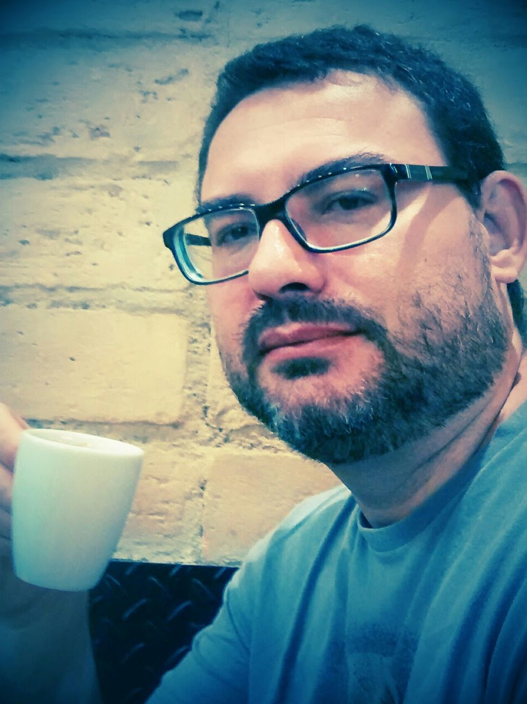

{width=30%}

**Olá!**

Sejam bem vindo(a)s ao meu site!

Aqui você vai encontrar informações sobre o uso de análise de dados em 
auditoria com uso do [software R](https://www.r-project.org/).

Meu objetivo é compartilhar com vocês algumas coisas que venho estudando nessa
área e vendo possibilidades de aplicação  em trabalhos de auditoria.

Minha formação é em Estatística mas trabalho com auditoria no setor público no
Tribunal de Contas do Estado do Rio de Janeiro - TCERJ já tem alguns anos. 
Por conta da minha formação tenho interesse na aplicação de métodos 
quantitativos em auditoria, área na qual infelizmente existe muita carência 
de conteúdo em português.

Caso você tenha alguma dica de análise, queira fazer alguma sugestão ou mesmo
crítica, pode encaminhar para o meu email: `marcosfs2006@gmail.com`.

Espero que gostem do site e que ele traga alguma inspiração e motivação para
que você inicie ou aprofunde seus estudos nessa área. Bons estudos!

Abs.

